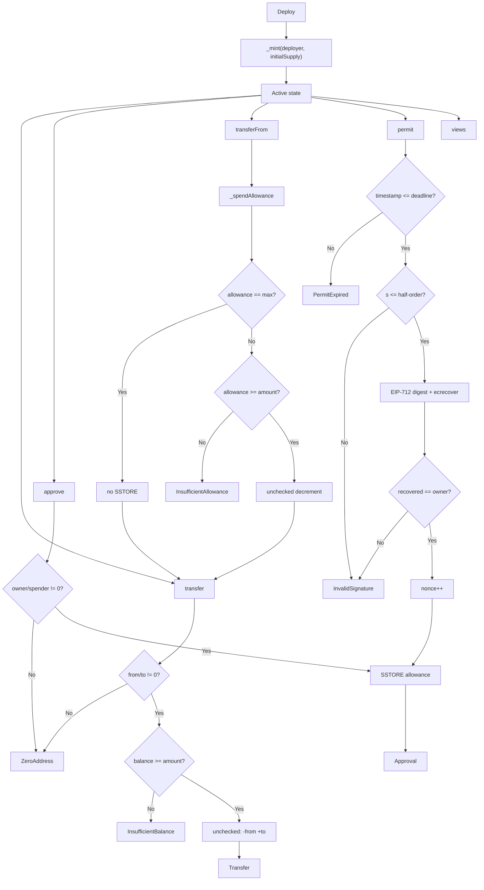

# Technical Decisions — ERC20PermitToken

> Versión en español: [`DECISIONES-TECNICAS-ES.md`](DECISIONES-TECNICAS-ES.md)

Reference document for module 01: what was decided, why, how the logic flows and where gas can still be saved.

Contract: `src/ERC20PermitToken.sol`  
Stack: Solidity `0.8.24` · Foundry · optimizer `runs = 200`

---

## 1. Technical Decisions

### 1.1 Product Scope

| Decision | Reason |
|----------|--------|
| Custom implementation (no OZ/Solmate inheritance in the final token) | Full control over gas, storage layout and audit surface; OZ/Solmate remain as references in `lib/`. |
| ERC-20 + EIP-2612 in a single contract | A typical production token needs both; Permit removes the on-chain `approve` tx. |
| No `burn`, pause, roles or upgradeability | Minimal surface: fewer SWC vectors and less bytecode gas. |
| Initial supply only in the constructor (`_mint` to the deployer) | No privileged post-deploy minter → no risk of arbitrary minting. |

### 1.2 Security and Standards

| Decision | Reason |
|----------|--------|
| **CEI** pattern (Checks → Effects → Interactions) | There are no external calls in this contract; the mental order still applies: validate → mutate state → emit events. |
| **Custom errors** instead of `require("…")` | Cheaper reverts and a cleaner ABI. |
| `address(0)` guards in mint, transfer, approve and permit | Prevents accidentally burning tokens or setting allowances to the zero address. |
| **Fork-safe** domain separator (`INITIAL_CHAIN_ID` + recompute if `block.chainid` changes) | After a fork, signatures from the original chain must no longer be valid. |
| Rejection of malleable signatures (EIP-2: `s > half-order`) | The same `permit` cannot be reused with a malleable `(v,r,s')`. |
| Per-owner nonce, incremented on every successful `permit` | On-chain replay protection. |
| Infinite allowance: `type(uint256).max` is not decremented | Standard DeFi pattern; saves one SSTORE on the `transferFrom` hot path. |

### 1.3 Gas (already applied)

| Technique | Where | Effect |
|-----------|-------|--------|
| `immutable` | `decimals`, `INITIAL_CHAIN_ID`, `INITIAL_DOMAIN_SEPARATOR`, `_NAME_HASH` | Read ~100 gas vs ~2100 SLOAD. |
| `constant` | `PERMIT_TYPEHASH`, `_DOMAIN_TYPEHASH`, `_VERSION_HASH`, `_SECP256K1_HALF_ORDER` | Inlined hashes/numbers; fewer keccak calls at runtime. |
| `_NAME_HASH` immutable | Domain separator on forks | No re-reading of the `string` from storage. |
| `unchecked` after bounds checks | `_transfer`, `_mint`, `_spendAllowance`, nonces in `permit` | No redundant overflow/underflow checks. |
| `external` functions in the public API | transfer, approve, transferFrom, permit, views | Cheaper calldata handling than `public` when there are no self-calls. |
| `abi.encodePacked("\x19\x01", …)` in the digest | `_hashTypedDataV4` | Fixed prefix cheaper than `abi.encode`. |
| Foundry optimizer `runs = 200` | `foundry.toml` | Balance between deploy cost and runtime (tokens usually prioritize runtime). |

### 1.4 Tooling and Quality

| Decision | Reason |
|----------|--------|
| Pinned pragma `0.8.24` | Reproducibility; no floating pragma. |
| Unit + fuzz (`bound`) + `vm.sign` tests for Permit | Coverage of happy paths and invalid/expired signatures. |
| Documented SWC / attack defensive campaigns | Integrity verification, not exploits. |

---

## 2. Contract Logic

### 2.1 State Model

```
_balances[account]           → balance
_allowances[owner][spender]  → authorized allowance
_nonces[owner]               → permit anti-replay
_totalSupply                 → sum of balances
name / symbol                → metadata (storage)
decimals                     → immutable
INITIAL_* / _NAME_HASH       → cached EIP-712 domain
```

Key invariant: Σ `_balances` == `_totalSupply` (mint only in the constructor; no burn).

### 2.2 Operation Flow



### 2.3 Internal Order per Function

**`transfer(to, amount)`**  
1. `_transfer(msg.sender, to, amount)`  
2. Zero-address + balance checks  
3. Effects: balances  
4. `Transfer` event  
5. `return true`

**`approve(spender, amount)`**  
1. Zero-address checks  
2. Effects: `_allowances`  
3. `Approval` event

**`transferFrom(from, to, amount)`**  
1. `_spendAllowance(from, msg.sender, amount)` (skipped if max)  
2. `_transfer(from, to, amount)`  
3. `return true`

**`permit(owner, spender, value, deadline, v, r, s)`**  
1. Deadline check  
2. `s` malleability check  
3. Read the current nonce (not incremented yet)  
4. Struct hash + domain separator + `\x19\x01` → digest  
5. `ecrecover`; validate `recovered == owner` and `!= address(0)`  
6. `nonce + 1` (unchecked)  
7. `_approve(owner, spender, value)`

**Domain separator**  
- If `block.chainid == INITIAL_CHAIN_ID` → return `INITIAL_DOMAIN_SEPARATOR` (hot path).  
- Otherwise (fork) → `_buildDomainSeparator(block.chainid)` with `_NAME_HASH` / constant typehashes.

### 2.4 Why the Order in `permit` Matters

The nonce is read **before** building the digest and incremented **only after** the signature is validated. This way:

- An old or already used nonce invalidates the signature.
- A signature failure does not consume the nonce.
- After success, the same digest cannot be reapplied.

---

## 3. Can the Existing Gas Usage Be Improved?

Yes, but the hot path is already in "production token" territory. The following improvements are **optional** and come with tradeoffs.

### 3.1 Realistic Improvements (low risk)

| Improvement | Estimated savings | Tradeoff |
|-------------|-------------------|----------|
| Raise `optimizer_runs` (e.g. 10_000–1_000_000) | Cheaper runtime for transfer/permit | More expensive deploy |
| Keeping `name`/`symbol` out of the hot path is already fine; consider `bytes32` for symbol if a 32-byte limit is acceptable | Less gas on deploy/metadata reads | Less flexibility than a "classic" ERC-20 |
| Cache `currentAllowance` / balances in local variables (already done in several places) | Avoids a double SLOAD | Already applied in `_transfer` / `_spendAllowance` |
| Minimal `assembly` in `_transfer` (Solmate-style) | Hundreds of gas per transfer | Harder to read and audit |
| Remove the `from == address(0)` check in `_transfer` if it is only called from paths with a non-zero `from` | A few dozen gas | Weaker defense in depth if someone adds internal callers |

### 3.2 Aggressive Improvements (more risk / less standard)

| Improvement | Comment |
|-------------|---------|
| Reordered / packed storage layout | With mappings dominating, packing helps little; `decimals` is already immutable. |
| ERC-7201 / namespaced storage | Useful for proxies; there is no upgrade here → cost without benefit. |
| Transient storage (EIP-1153) | Does not apply to the persistent balance model. |
| Permit2 / external allowance | Changes the product; it is not "optimizing this contract". |
| Remove events | Saves gas but breaks indexers and the de facto standard. |

### 3.3 What **Not** to Touch

- Removing the EIP-2 malleable `s` check → negligible savings, risk of malleable replay.  
- Removing the domain separator fork-safety → signatures valid on forks.  
- Removing zero-address guards → lost tokens / garbage allowances.  
- `unchecked` without validating bounds first → silent underflow/overflow.

### 3.4 Gas Verdict

For an educational yet production-minded ERC-20 + Permit, the current design is **solid**: immutables on the hot path, EIP-712 constants, infinite allowance, justified `unchecked` and custom errors.

The next serious gas jump would be Solmate-style (assembly in transfer) or a token with fixed `bytes32` metadata, not micro-tweaks to the current code. Prioritize a high `optimizer_runs` if the token will be deployed once and used heavily.

---

## 4. Quick Map: File ↔ Responsibility

| File | Role |
|------|------|
| `src/ERC20PermitToken.sol` | On-chain logic |
| `src/interfaces/IERC20.sol` | ERC-20 API |
| `src/interfaces/IERC20Permit.sol` | Permit API |
| `test/ERC20PermitToken.t.sol` | Unit + fuzz + signatures |
| `script/Deploy.s.sol` | Foundry deploy |
| `doc/FASES-EN.md` | Build history |
| `doc/SWC-AUDIT-EN.md` | SWC defensive matrix |
| `doc/ATAQUES-EN.md` | Verification campaigns |
| `doc/flujograma-EN.md` | Operational flowchart |

---

## 5. One-Sentence Summary

A custom ERC-20 was built with EIP-2612 Permit, a fork-proof domain separator, strict guards and conventional gas optimizations (immutables, constants, post-check unchecked, max allowance); the logic is CEI + nonces + ecrecover; further gas savings are possible mainly through an aggressive optimizer or assembly, at the cost of readability or deploy cost.
