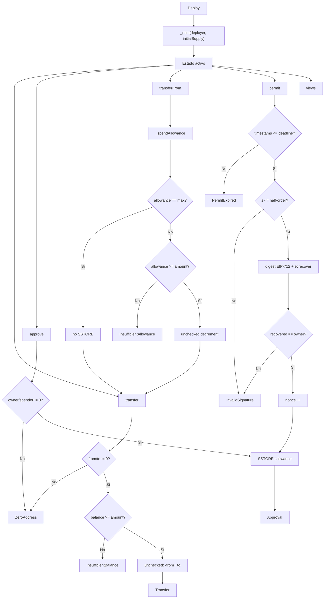

# Decisiones técnicas — ERC20PermitToken

> English version: [`DECISIONES-TECNICAS-EN.md`](DECISIONES-TECNICAS-EN.md)

Documento de referencia del módulo 01: qué se decidió, por qué, cómo fluye la lógica y dónde aún se puede ahorrar gas.

Contrato: `src/ERC20PermitToken.sol`  
Stack: Solidity `0.8.24` · Foundry · optimizer `runs = 200`

---

## 1. Decisiones técnicas

### 1.1 Alcance del producto

| Decisión | Motivo |
|----------|--------|
| Implementación propia (no heredar OZ/Solmate en el token final) | Control total del gas, del layout de storage y de la superficie de auditoría; OZ/Solmate quedan como referencia en `lib/`. |
| ERC-20 + EIP-2612 en un solo contrato | Un token de producción típico necesita ambos; Permit evita la tx de `approve` on-chain. |
| Sin `burn`, pausa, roles ni upgradeability | Superficie mínima: menos vectores SWC y menos gas de bytecode. |
| Supply inicial solo en el constructor (`_mint` al deployer) | No hay minter privilegiado post-deploy → no hay riesgo de mint arbitrario. |

### 1.2 Seguridad y estándares

| Decisión | Motivo |
|----------|--------|
| Patrón **CEI** (Checks → Effects → Interactions) | En este contrato no hay calls externos; igual se aplica el orden mental: validar → mutar estado → emitir eventos. |
| **Custom errors** en lugar de `require("…")` | Reverts más baratos y ABI más limpia. |
| Guards de `address(0)` en mint, transfer, approve y permit | Evita quemar tokens o allowances a la dirección cero por error. |
| Domain separator **fork-safe** (`INITIAL_CHAIN_ID` + recomputo si cambia `block.chainid`) | Tras un fork, firmas de la chain original no deben seguir siendo válidas. |
| Rechazo de firmas malleables (EIP-2: `s > half-order`) | Un mismo `permit` no puede reutilizarse con `(v,r,s')` malleable. |
| Nonce por owner, incrementado en cada `permit` exitoso | Replay protection on-chain. |
| Allowance infinita: `type(uint256).max` no se decrementa | Patrón DeFi estándar; ahorra un SSTORE en `transferFrom` hot path. |

### 1.3 Gas (ya aplicado)

| Técnica | Dónde | Efecto |
|---------|-------|--------|
| `immutable` | `decimals`, `INITIAL_CHAIN_ID`, `INITIAL_DOMAIN_SEPARATOR`, `_NAME_HASH` | Lectura ~100 gas vs ~2100 SLOAD. |
| `constant` | `PERMIT_TYPEHASH`, `_DOMAIN_TYPEHASH`, `_VERSION_HASH`, `_SECP256K1_HALF_ORDER` | Hashes/números inlined; menos keccak en runtime. |
| `_NAME_HASH` immutable | Domain separator en forks | No releer `string` de storage. |
| `unchecked` tras bounds | `_transfer`, `_mint`, `_spendAllowance`, nonces en `permit` | Sin checks de overflow/underflow redundantes. |
| Funciones `external` en la API pública | transfer, approve, transferFrom, permit, views | Copy de calldata más barato que `public` cuando no hay self-calls. |
| `abi.encodePacked("\x19\x01", …)` en digest | `_hashTypedDataV4` | Prefijo fijo más barato que `abi.encode`. |
| Optimizer Foundry `runs = 200` | `foundry.toml` | Balance deploy cost vs runtime (tokens suelen priorizar runtime). |

### 1.4 Tooling y calidad

| Decisión | Motivo |
|----------|--------|
| Pragma fijo `0.8.24` | Reproducibilidad; sin floating pragma. |
| Tests unitarios + fuzz (`bound`) + `vm.sign` para Permit | Cobertura de paths felices y de firmas inválidas/expiradas. |
| Campañas defensivas SWC / ataques documentadas | Verificación de integridad, no exploits. |

---

## 2. Lógica que sigue el contrato

### 2.1 Modelo de estado

```
_balances[account]           → saldo
_allowances[owner][spender]  → cupo autorizado
_nonces[owner]               → anti-replay de permit
_totalSupply                 → suma de balances
name / symbol                → metadata (storage)
decimals                     → immutable
INITIAL_* / _NAME_HASH       → domain EIP-712 cacheado
```

Invariante clave: Σ `_balances` == `_totalSupply` (mint solo en constructor; no hay burn).

### 2.2 Flujo de operaciones



### 2.3 Orden interno por función

**`transfer(to, amount)`**  
1. `_transfer(msg.sender, to, amount)`  
2. Checks zero-address + balance  
3. Effects: balances  
4. Event `Transfer`  
5. `return true`

**`approve(spender, amount)`**  
1. Checks zero-address  
2. Effects: `_allowances`  
3. Event `Approval`

**`transferFrom(from, to, amount)`**  
1. `_spendAllowance(from, msg.sender, amount)` (skip si max)  
2. `_transfer(from, to, amount)`  
3. `return true`

**`permit(owner, spender, value, deadline, v, r, s)`**  
1. Check deadline  
2. Check malleability de `s`  
3. Leer nonce actual (sin incrementar aún)  
4. Struct hash + domain separator + `\x19\x01` → digest  
5. `ecrecover`; validar `recovered == owner` y `!= address(0)`  
6. `nonce + 1` (unchecked)  
7. `_approve(owner, spender, value)`

**Domain separator**  
- Si `block.chainid == INITIAL_CHAIN_ID` → devolver `INITIAL_DOMAIN_SEPARATOR` (camino caliente).  
- Si no (fork) → `_buildDomainSeparator(block.chainid)` con `_NAME_HASH` / typehashes constantes.

### 2.4 Por qué el orden de `permit` importa

El nonce se lee **antes** de firmar el digest y se incrementa **solo tras** validar la firma. Así:

- Un nonce viejo o ya usado invalida la firma.
- Un fallo de firma no consume nonce.
- Tras éxito, el mismo digest no puede reaplicarse.

---

## 3. ¿Se puede mejorar el gas de lo que existe?

Sí, pero el hot path ya está en territorio “token production”. Las mejoras siguientes son **opcionales** y tienen tradeoffs.

### 3.1 Mejoras realistas (bajo riesgo)

| Mejora | Ahorro estimado | Tradeoff |
|--------|-----------------|----------|
| Subir `optimizer_runs` (p. ej. 10_000–1_000_000) | Runtime más barato en transfer/permit | Deploy más caro |
| Empaquetar `name`/`symbol` fuera del hot path ya está bien; valorar `bytes32` para symbol si se acepta límite de 32 bytes | Menos gas en deploy/lecturas de metadata | Menos flexibilidad ERC-20 “clásico” |
| Cachear `currentAllowance` / balances en variables locales (ya se hace en varios sitios) | Evita SLOAD doble | Ya aplicado en `_transfer` / `_spendAllowance` |
| `assembly` mínimo en `_transfer` (Solmate-style) | Cientos de gas por transfer | Legibilidad y auditoría más difíciles |
| Quitar check `from == address(0)` en `_transfer` si solo se llama desde paths con `from` no-cero | Unas decenas de gas | Defensa en profundidad más débil si alguien añade callers internos |

### 3.2 Mejoras agresivas (más riesgo / menos estándar)

| Mejora | Comentario |
|--------|------------|
| Layout de storage reordenado / packed | Con mappings dominantes el packing ayuda poco; `decimals` ya es immutable. |
| ERC-7201 / namespaced storage | Útil para proxies; aquí no hay upgrade → coste sin beneficio. |
| Transient storage (EIP-1153) | No aplica al modelo de balances persistentes. |
| Permit2 / allowance externa | Cambia el producto; no es “optimizar este contrato”. |
| Eliminar eventos | Ahorra gas pero rompe indexadores y el estándar de facto. |

### 3.3 Lo que **no** conviene tocar

- Quitar el check EIP-2 de `s` malleable → ahorro ínfimo, riesgo de replay malleable.  
- Quitar fork-safety del domain separator → firmas válidas en forks.  
- Quitar zero-address guards → tokens perdidos / allowances basura.  
- `unchecked` sin validar bounds antes → underflow/overflow silencioso.

### 3.4 Veredicto gas

Para un ERC-20 + Permit didáctico y production-minded, el diseño actual es **sólido**: immutables en el camino caliente, constants de EIP-712, allowance infinita, `unchecked` justificado y custom errors.

El siguiente salto de gas serio sería estilo Solmate (assembly en transfer) o un token con metadata fija en `bytes32`, no micro-tweaks al código actual. Priorizar `optimizer_runs` alto si el token se desplegará una vez y se usará mucho.

---

## 4. Mapa rápido archivo ↔ responsabilidad

| Archivo | Rol |
|---------|-----|
| `src/ERC20PermitToken.sol` | Lógica on-chain |
| `src/interfaces/IERC20.sol` | API ERC-20 |
| `src/interfaces/IERC20Permit.sol` | API Permit |
| `test/ERC20PermitToken.t.sol` | Unit + fuzz + firmas |
| `script/Deploy.s.sol` | Deploy Foundry |
| `doc/FASES-ES.md` | Historial de construcción |
| `doc/SWC-AUDIT-ES.md` | Matriz defensiva SWC |
| `doc/ATAQUES-ES.md` | Campañas de verificación |
| `doc/flujograma-ES.md` | Diagrama de flujo operativo |

---

## 5. Resumen en una frase

Se construyó un ERC-20 propio con Permit EIP-2612, domain separator a prueba de forks, guards estrictos y optimizaciones de gas convencionales (immutables, constants, unchecked post-check, allowance max); la lógica es CEI + nonces + ecrecover; mejorar más gas es posible sobre todo con optimizer agresivo o assembly, a costa de legibilidad o coste de deploy.
