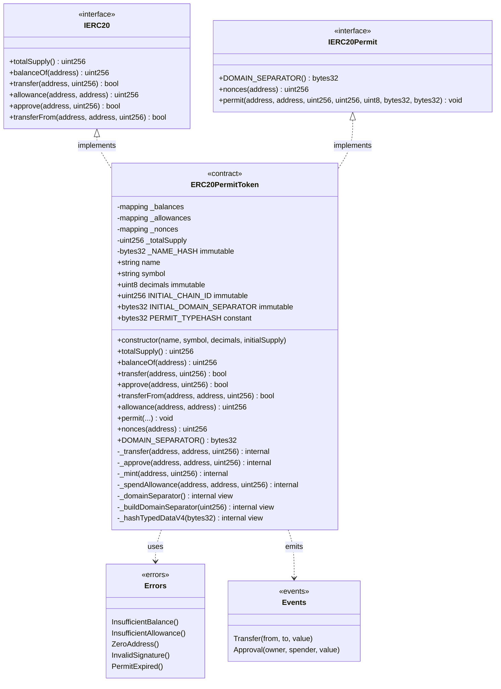
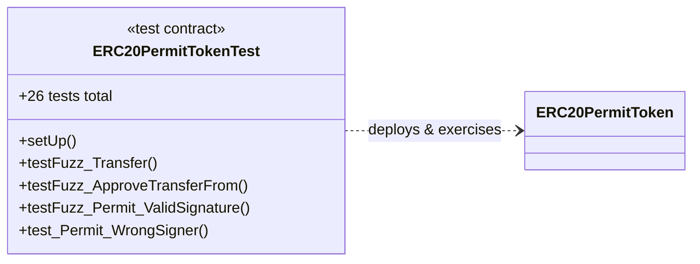

# Class Diagram — ERC-20 Token with EIP-2612 Permit

> Versión en español: [`diagrama-de-clases-ES.md`](diagrama-de-clases-ES.md)

Model of contracts, interfaces, state and relationships of module 01 (final implementation).

## Component Description

### Interfaces

| Interface | Responsibility |
|-----------|----------------|
| `IERC20` | Standard ERC-20 contract: balances, transfers and approvals |
| `IERC20Permit` | EIP-2612 extension: `permit()`, nonces and domain separator |

### Main State

| Variable | Type | Visibility | Notes |
|----------|------|------------|-------|
| `_balances` | `mapping(address => uint256)` | private | Balance per account |
| `_allowances` | `mapping(address => mapping(address => uint256))` | private | Delegated approvals |
| `_nonces` | `mapping(address => uint256)` | private | EIP-2612 nonces per owner |
| `_totalSupply` | `uint256` | private | Total supply in circulation |
| `_NAME_HASH` | `bytes32` | private immutable | Name hash for EIP-712 |
| `decimals` | `uint8` | immutable | Token decimals |
| `INITIAL_CHAIN_ID` | `uint256` | immutable | Chain ID at deploy time (fork safety) |
| `INITIAL_DOMAIN_SEPARATOR` | `bytes32` | immutable | Separator precomputed at deploy time |
| `PERMIT_TYPEHASH` | `bytes32` | public constant | Hash of the Permit struct |

### Key Internal Functions

| Function | Role |
|----------|------|
| `_transfer` | Core transfer logic with CEI guards |
| `_approve` | Sets allowance with zero-address guard |
| `_mint` | Initial mint in the constructor (supply to the deployer) |
| `_spendAllowance` | Consumes allowance; supports `type(uint256).max` |
| `_domainSeparator` | Returns the immutable separator or recomputes it on a fork |
| `_buildDomainSeparator` | Builds the EIP-712 domain separator |
| `_hashTypedDataV4` | Builds the EIP-712 digest for `ecrecover` |

### Relationship with Tests (Foundry)

