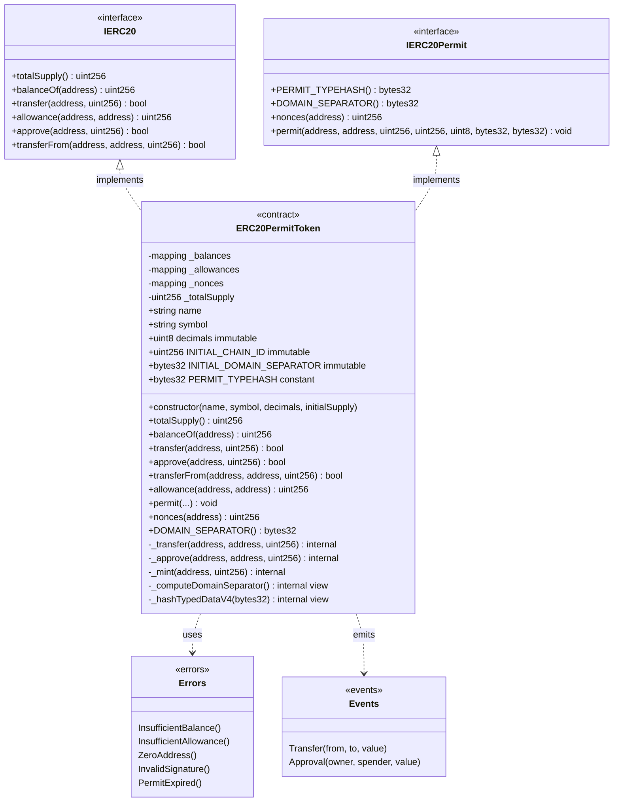
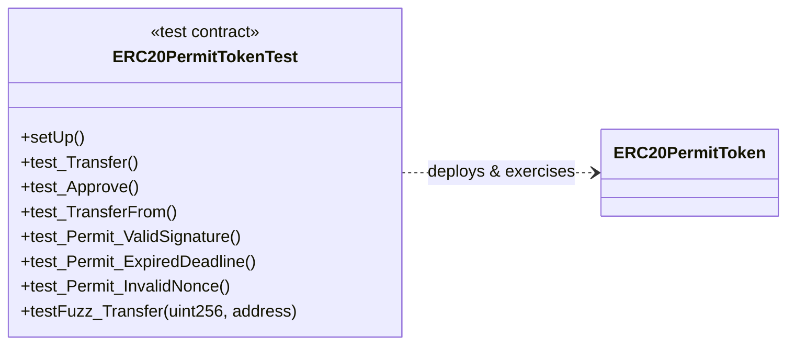

# Diagrama de Clases — ERC-20 Token con EIP-2612 Permit

Modelo de contratos, interfaces, estado y relaciones del módulo 01.

## Descripción de componentes

### Interfaces

| Interface | Responsabilidad |
|-----------|-----------------|
| `IERC20` | Contrato estándar ERC-20: balances, transferencias y aprobaciones |
| `IERC20Permit` | Extensión EIP-2612: `permit()`, nonces y domain separator |

### Estado principal

| Variable | Tipo | Visibilidad | Notas |
|----------|------|-------------|-------|
| `_balances` | `mapping(address => uint256)` | private | Saldos por cuenta |
| `_allowances` | `mapping(address => mapping(address => uint256))` | private | Aprobaciones delegadas |
| `_nonces` | `mapping(address => uint256)` | private | Nonces EIP-2612 por owner |
| `_totalSupply` | `uint256` | private | Supply total en circulación |
| `decimals` | `uint8` | immutable | Decimales del token |
| `INITIAL_CHAIN_ID` | `uint256` | immutable | Chain ID al deploy (fork safety) |
| `INITIAL_DOMAIN_SEPARATOR` | `bytes32` | immutable | Separator precalculado al deploy |
| `PERMIT_TYPEHASH` | `bytes32` | constant | Hash del struct Permit |

### Funciones internas clave

| Función | Rol |
|---------|-----|
| `_transfer` | Lógica central de transferencia con guards CEI |
| `_approve` | Establece allowance con guard de zero-address |
| `_mint` | Mint inicial en constructor (supply al deployer) |
| `_computeDomainSeparator` | Recalcula separator si cambia `chainid` |
| `_hashTypedDataV4` | Construye digest EIP-712 para `ecrecover` |

### Relación con tests (Foundry)

