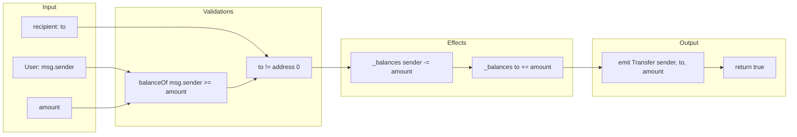
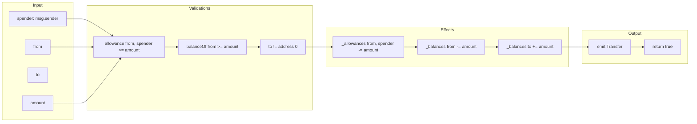
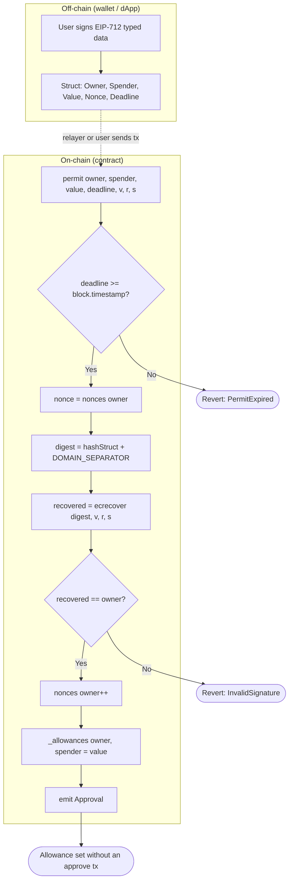
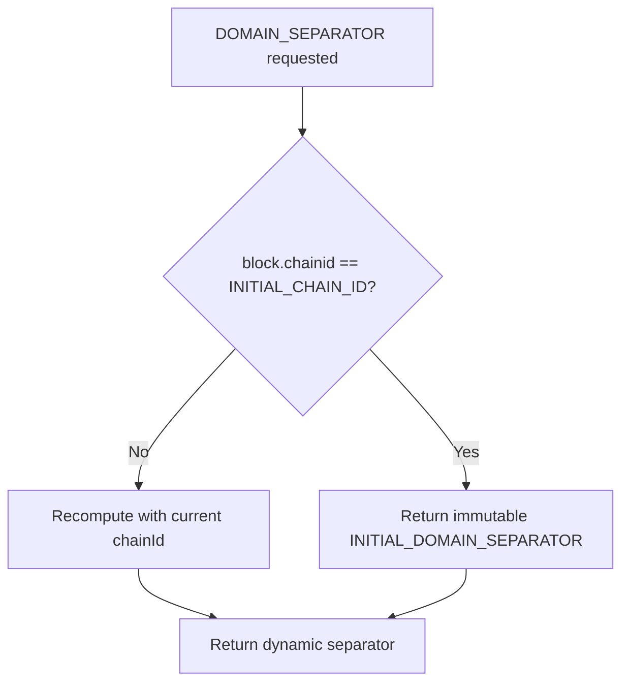

# Flow Diagram — Critical Operations

> Versión en español: [`diagrama-de-flujo-ES.md`](diagrama-de-flujo-ES.md)

Detailed data and control flow for `transfer`, `transferFrom` and `permit`.

## 1. Direct transfer flow (`transfer`)

## 2. Delegated transfer flow (`transferFrom`)

## 3. Off-chain approval flow (`permit` — EIP-2612)

## 4. Dynamic Domain Separator (fork safety)

