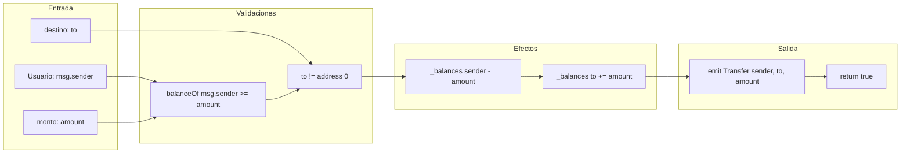
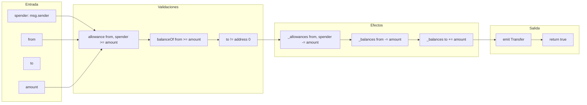
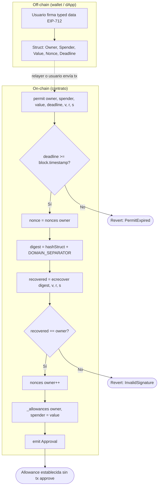
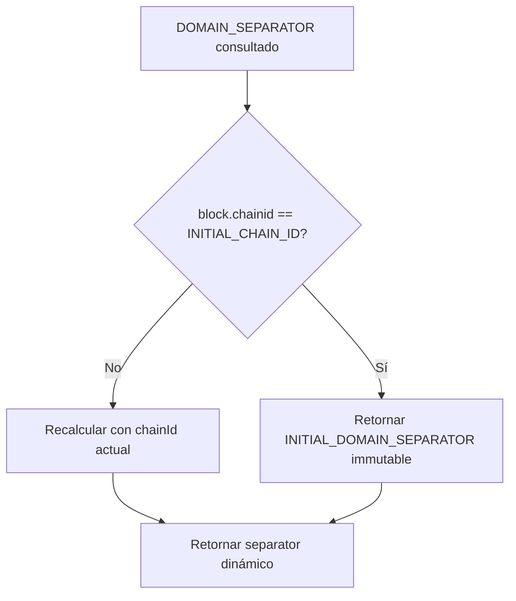

# Diagrama de Flujo — Operaciones críticas

> English version: [`diagrama-de-flujo-EN.md`](diagrama-de-flujo-EN.md)

Detalle del flujo de datos y control para `transfer`, `transferFrom` y `permit`.

## 1. Flujo de transferencia directa (`transfer`)

## 2. Flujo de transferencia delegada (`transferFrom`)

## 3. Flujo de aprobación off-chain (`permit` — EIP-2612)

## 4. Domain Separator dinámico (fork safety)

