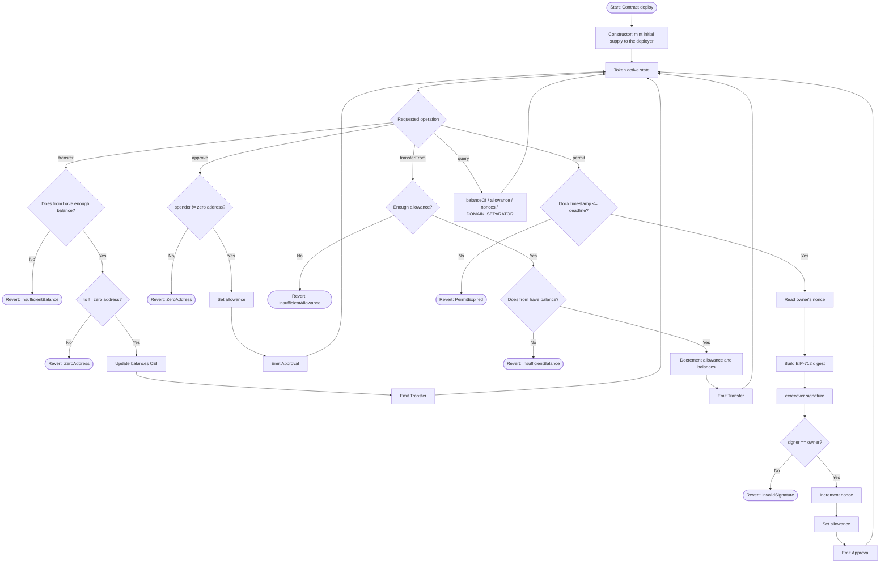

# Flowchart — ERC-20 Token with EIP-2612 Permit

> Versión en español: [`flujograma-ES.md`](flujograma-ES.md)

Overview of the token lifecycle and the main operations supported by the contract.

## Legend

| Symbol | Meaning |
|--------|---------|
| Rectangle | Process / action |
| Diamond | Decision / validation |
| Stadium | Start or end point |
| CEI | Checks-Effects-Interactions (security pattern) |
