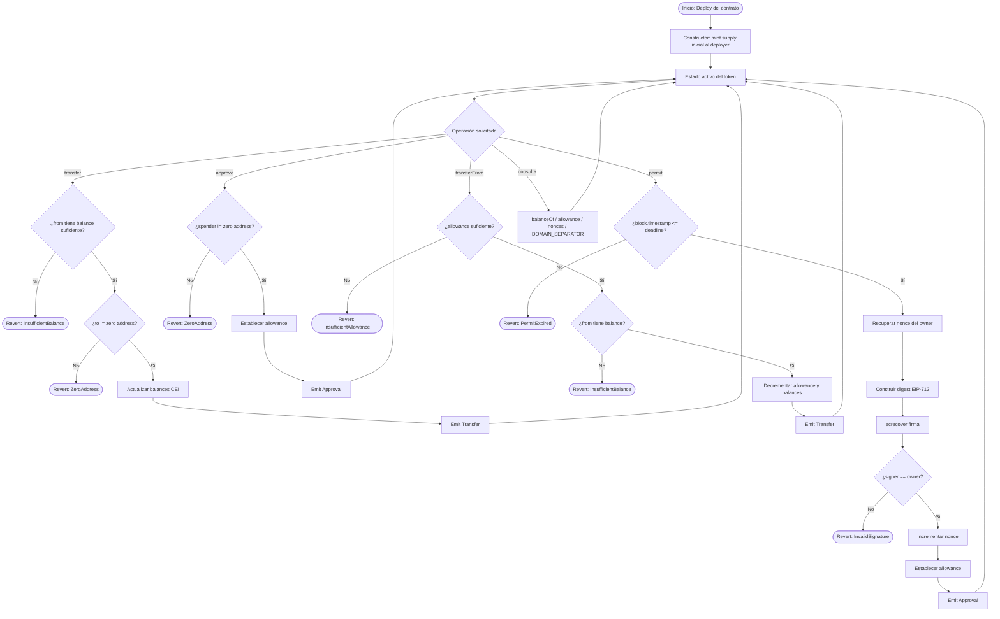

# Flujograma — ERC-20 Token con EIP-2612 Permit

Vista general del ciclo de vida del token y las operaciones principales soportadas por el contrato.

## Leyenda

| Símbolo | Significado |
|---------|-------------|
| Rectángulo | Proceso / acción |
| Rombo | Decisión / validación |
| Estadio | Punto de inicio o fin |
| CEI | Checks-Effects-Interactions (patrón de seguridad) |
